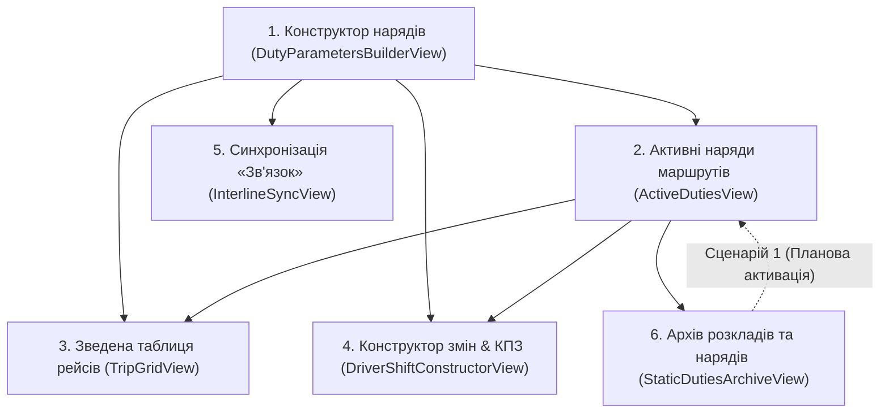

# 📘 ПАСПОРТ ПІДСИСТЕМИ «ПЛАНУВАННЯ РОЗКЛАДІВ»
## КП «ОДЕСМІСЬКЕЛЕКТРОТРАНС» (СЛУЖБА РУХУ)

> **Версія системи:** 2.5-Enterprise Scheduling System  
> **Останнє оновлення:** Вересень 2026 р.  
> **Статус розробки:** Production-Ready Core (6 діючих бойових вкладок)  
> **Законодавча та нормативна база:** КЗпП України, Правила експлуатації трамвая та тролейбуса України, Технологічний регламент Служби Руху КП «ОМЕТ».

---

## 1. ЦІЛЬ ТА АРХІТЕКТУРНЕ ПРИЗНАЧЕННЯ

Підсистема «Планування» призначена для автоматизованої розробки, оптимізації, валідації, оперативного моніторингу та архівування добових графіків руху трамвайних і тролейбусних маршрутів міста Одеси.

Головні задачі:
1. Забезпечення регулярного руху пасажирського електротранспорту з рівномірними тактовими інтервалами.
2. Неухильне дотримання норм трудового законодавства України (КЗпП) та вимог охорони праці водіїв.
3. Оптимізація нульових технічних пробігів від 3-х депо (ТД-1, ТД-2, ТРД-1) до лінійних диспетчерських пунктів (ДП) з урахуванням посадки пасажирів від зупинок примикання.
4. Синхронізація спільних трамвайних і тролейбусних коридорів міста (запобігання караванінгу / «паровозикам»).
5. Оперативний контроль та керування діючими нарядами (редагування, збереження у шаблони, перенесення в архів).
6. Безпечне планове введення в дію затверджених графіків руху (Сценарій 1).

---

## 2. КАРТА 6 ДІЮЧИХ БОЙОВИХ ВКЛАДОК МЕНЮ

Підсистема структурована за 6 послідовними етапами виробничого циклу Служби Руху:

### Вкладка 1: ⚙️ «Конструктор нарядів»
- **Файли:** `DutyParametersBuilderView.tsx`, `DutyMacroStep.tsx`, `DutyMicroStep.tsx`, `DutyValidationSummaryStep.tsx`, `useDutyParametersBuilderLogic.ts`.
- **Призначення:** Трикроковий візард побудови розкладу маршруту:
  - **Крок 1 (Макро-параметри):** Вибір виду транспорту (трамвай/тролейбус), типу графіка (Будній, Вихідний, Святковий), маршруту, кількості нарядів $N$, введення експлуатаційної швидкості $V_{спол}$ (км/год), розрахунок статичного інтервалу $I = T_{об} / N$ з можливістю ручного коригування диспетчером, вибір Головного ДП та депо приписки.
  - **Крок 2 (Конструктор нарядів):** Індивідуальне налаштування кожного наряду: тип із БД (`DOUBLE`, `SINGLE`, `SPLIT`, `PEAK`), розрахунок нульового рейсу депо $\to$ кінцева Б $\to$ ДП, закріплення бортів та водіїв. Обід і ротація вагонів (для `SPLIT`) НЕ конфігуруються вручну — алгоритм завжди прив'язує їх до прибуття на ДП (колонка «Ротація вагонів (SPLIT)» показує це як фіксоване, нередаговане значення).
  - **Крок 3 (Валідація КЗпП та баланс годин):** Контроль ліміту зміни кожної зміни $\le 9:59$, графік випуску та поетапного вечірнього заїзду (20:30–22:30), підтвердження та перехід до Зведеної таблиці.

### Вкладка 2: ⚡ «Активні наряди маршрутів»
- **Файли:** `ActiveDutiesView.tsx`, `ActiveDutiesToolbar.tsx`, `ActiveDutyRouteCard.tsx`, `SaveScheduleTemplateModal.tsx`, `useActiveDutiesLogic.ts`.
- **Призначення:** Оперативне керування всіма затвердженими та діючими нарядами КП «ОМЕТ» (`status == 'ACTIVE'`):
  - **Аналітична панель KPI:** Відображення загальної кількості діючих маршрутів (розподіл на трамвай і тролейбус), сумарної кількості нарядів на лінії, добової кількості рейсів, сумарного вагоно-кілометражу та середнього планового інтервалу.
  - **Оперативні картки маршрутів:** Детальна інформація про закріплені депо, сезон, тип дня, перелік усіх нарядів із закріпленими водіями (ПІБ, табельний номер) та бортами.
  - **Управління життєвим циклом:**
    - 🔍 Перегляд та редагування в Зведеній таблиці (`/planning/matrix`);
    - ✂️ Перехід до Конструктора змін & КПЗ (`/planning/shifts`);
    - 💾 Збереження перевіреного наряду в базу багаторазових шаблонів підприємства (`ScheduleTemplate` в `omet.db`);
    - 📦 Перенесення застарілого розкладу в архів (`POST /api/v1/schedules/{id}/archive`);
    - 🗑️ Видалення наряду з бази даних.

### Вкладка 3: 🏁 «Зведена таблиця рейсів»
- **Файли:** `TripGridView.tsx`, `TripGridToolbar.tsx`, `TripGridTable.tsx`, `TripGridEditModal.tsx`, `useTripGridLogic.ts`.
- **Призначення:** Детальна зведена відомість рейсів за нарядами та контроль регулярності:
  - **Два режими роботи:**
    - 🕒 **«Час рейсів»**: класичний табличний графік виходів на лінію, прибуття/відправлення на ст. А та ст. Б для кожного круга.
    - ⏱️ **«Контроль інтервалів» (Headway Audit)**: розрахунок інтервалів між послідовними вагонами з автоматичним підсвічуванням аномалій (пачкування $\le 2$ хв — червоний, розрив такту $> I + 3.5$ хв — бурштиновий, нормальний інтервал — зелений).
  - **Оперативне інлайн-редагування часу рейсу:** клік на комірку відкриває діалог `TripGridEditModal` з кнопками мікро-зсуву ($\pm 1$ хв, $\pm 5$ хв) та миттєвою синхронізацією оновлень у PostgreSQL/SQLite `omet.db`.
  - Маркування обідів `[О-15]`, `[О-20]`, `[О-30*]`, перезмінки `[ЗМ]` та ротації рухомого складу розривного наряду `[РОТ]` — усі три завжди прив'язані до ДП (див. 4.3).
  - **Панель умовних позначень (`TripGridLegendBar.tsx`):** окремий переюзаний компонент над таблицею з 6 категоріями позначень (графіковий рейс, базовий/понаднормовий обід, перезмінка, ротація SPLIT, скупчення інтервалів), кожна з підказкою.
  - **Спливаючі підказки (`src/components/common/Tooltip.tsx`):** перший у проєкті доступний (accessible) Tooltip-компонент — показ по наведенню миші й по клавіатурному Tab-фокусу, закриття по Escape. У таблиці підказка на бейджі обіду показує локацію (ДП), точний час, явку водія та понаднормові хвилини.
  - Робочий час вагона на лінії та табельний час водіїв (І зміна та ІІ зміна) строго до 9:59.
  - **Принцип персональної відповідальності Служби Руху:** Розклад ніколи не генерується «на льоту» у фоновому режимі без участі фахівця. Якщо розклад для обраного маршруту ще не розрахований працівниками, зведена таблиця показує штатний екран очікування розкладу з можливістю переходу до Конструктора нарядів. Складання та затвердження розкладу — це виключна відповідальність інженерів-технологів КП «ОМЕТ».
  - Модуль друку наказного розкладу А4/А5 з офіційними підписами керівництва Служби Руху.
  - Експорт у формат Excel (.csv).

### Вкладка 4: ✂️ «Конструктор змін & КПЗ»
- **Файли:** `DriverShiftConstructorView.tsx`, `DriverShiftConstructorToolbar.tsx`, `DriverShiftCard.tsx`, `DriverShiftEmptyState.tsx`, `DriverShiftAssignmentModal.tsx`, `KPZCardPrinterModal.tsx`, `useDriverShiftConstructorLogic.ts`.
- **Призначення:** Нарізка, нормування та персональне закріплення робочих змін бригад водіїв:
  - **Без фонової автогенерації:** Робочі зміни формуються суворо на основі затвердженого розкладу з бази даних (`schedules` $\to$ `static_duties` $\to$ `static_shifts` $\to$ `static_trips`). Якщо активного розкладу немає, відображається `DriverShiftEmptyState` з посиланням на Вкладку 1.
  - **Підготовчо-заключний час (ПЗЧ):** 10 хв для трамвая (ТД-1, ТД-2) / 19 хв для тролейбуса (ТРД-1). Розрахунок часу явки в депо перед нульовим виїздом: $t_{\text{депо}} = t_{\text{виїзду}} - t_{ПЗЧ}$.
  - **Кольорова градація та ліміти КЗпП:**
    - $\le 8:00$ — «Норма» (`VALID`, темно-зелений / смарагдовий);
    - $8:01 - 9:59$ — «Подовжена» (`EXTENDED`, світло-зелений колір — законне подовження згідно з підсумованим обліком робочого часу КЗпП);
    - $\ge 10:00$ (600 хв і більше) — «Порушення» (`VIOLATION`, червоний колір).
    - *(Індикатор 12-годинного міжзмінного відпочинку виключено за вимогою замовника, оскільки табелювання відпочинку здійснюється на рівні щомісячних графіків виходів водіїв)*.
  - **Розривні наряди (SPLIT):** Підтримка роботи з 2 різними вагонами (Вагон А на ранок $\to$ ТО депо; Вагон Б з депо на вечірній пік).
  - **Закріплення водіїв та рухомого складу:** Інтерактивне модальне вікно `DriverShiftAssignmentModal` для закріплення водія (ПІБ, табельний номер) та борта вагона із персистентним збереженням у таблицю `driver_shifts` БД (`POST /api/v1/shifts/assign-driver`).
  - **Офіційний друкований бланк КПЗ:** Повна картка зміни КП «Одесміськелектротранс» із хронологією подій, розрахунком робочого/кермового часу, нічних годин та блоками офіційних підписів.

### Вкладка 5: 📻 «Синхронізація "Зв'язок"»
- **Файли:** `InterlineSyncView.tsx`, `InterlineSyncToolbar.tsx`, `InterlineCorridorCards.tsx`, `InterlineSyncRules.tsx`, `InterlineRoutePairPanel.tsx`, `InterlineMissingScheduleAlert.tsx`, `InterlineTimelineModal.tsx`, `useInterlineSyncLogic.ts`.
- **Призначення:** Міжмаршрутна тактова координація на спільних коридорах та коліях:
  - **Принцип обов'язкової наявності нарядів у БД:** Синхронізація розраховується виключно за наявності затверджених нарядів для обох маршрутів (`schedules.status == 'ACTIVE'`). Якщо для одного або обох маршрутів розклад відсутній, система блокує розрахунок та відображає `InterlineMissingScheduleAlert` з кнопками переходу у Вкладку 1.
  - **Два режими роботи:**
    - 🏙️ **Магістральні коридори ОМЕТ (10 коридорів):** Пересипський №1, 6, 7; Люстдорфський №7, 13, 26, 27; Фонтанський №17, 18; Привокзальний №5, 28; Слобідський №12, 15; Шевченківський Тр7, 9, 10 тощо. Кожна картка відображає реальний статус із БД (`SYNCHRONIZED`, `NEEDS_SYNC`, `MISSING_SCHEDULES`) та кнопки швидкого усунення скупчень.
    - 🔀 **Парна координація (`InterlineRoutePairPanel`):** Вибір двох будь-яких маршрутів зі спільними зупинками, визначення ключового вузла, підрахунок конфліктів скупчення ($< 2.0$ хв) та кнопка запуску фазового зсуву.
  - **Хронологічна рейс-стрічка вузла (`InterlineTimelineModal`):** Похвилинний розпис проходження вагонів/тролейбусів через спільну зупинку із кольоровою шкалою безпеки інтервалів та можливістю усунення накладок в один клік.
  - **Алгоритм фазових мікро-зсувів:** Зсув часу відправлень на $\Delta t \in [-2, +2]$ хв з гарантією лімітів КЗпП ($\le 9:59$) та збереженням оновлених рейсів у `static_trips` і `static_stop_times` в `omet.db`.

### Вкладка 6: 🗄️ «Архів розкладів та нарядів»
- **Файли:** `StaticDutiesArchiveView.tsx`, `StaticDutiesArchiveCard.tsx`, `StaticDutiesArchiveToolbar.tsx`, `ScheduleActivationModal.tsx`, `useStaticDutiesArchiveLogic.ts`.
- **Призначення:** Централізоване сховище версій розкладів та безпечне введення в дію нових графіків:
  - **Сценарій 1 (Планове введення в дію з визначеної дати):**
    - Безпечний перехід на новий розклад без аварійного зриву поточної зміни на лінії: розклад призначається на дату (за замовчуванням: наступний день, випуск 04:30).
    - Діючий розклад спокійно допрацьовує свій робочий день.
    - Диспетчерська служба завчасно отримує системне сповіщення `STATIC_SCHEDULE_PLANNED_ACTIVATION`.
    - Зручний діалог підтвердження `ScheduleActivationModal` із вибором дати.
  - **Експорт та документація:**
    - Прямий експорт у CSV (Excel) та друк наказного бланку.
    - Кнопку GTFS Open Data (ZIP) повністю вилучено з вкладки за вимогами замовника (GTFS-експорт зосереджено в налаштуваннях мережі).
  - **Утилізація:** Остаточне вилучення непотрібних версій із бази даних (`DELETE /api/v1/schedules/{id}`).

---

## 3. БАЗА ДАНИХ ТА СТРУКТУРА ТАБЛИЦЬ

База даних PostgreSQL (`omet_db`) з локальним резервуванням SQLite (`backend/omet.db`) містить такі ключові сутності для планування:

1. **`routes` (`RouteModel`):**
   - `id`, `number`, `name`, `type` (`TRAM` / `TROLLEYBUS`), `length_km`, `default_speed_kmh`, `round_trip_min`, `t_dir0_min`, `t_dir1_min`, `layover_min`, `designated_dp_id`, `primary_depot_id`, `depot_junction_stop_id`.
2. **`duty_types` (`DutyTypeModel`):**
   - Довідник типів нарядів:
     - `DOUBLE`: «Двозмінний» (код ДВ, макс зміна 9:59);
     - `SINGLE`: «Однозмінний» (код ОД, зміна до 8:00);
     - `SPLIT`: «Розривний» (код РОЗ, ранок + вечір, макс зміна 9:59);
     - `PEAK`: «Піковий» (код ПІК, 4.5–6.5 год);
     - `NIGHT`: «Черговий» (код ЧЕР, нічна розвозка).
3. **`depots` (`DepotModel`):**
   - `depot_1`: ТД-1 ім. Шевченка (Водопровідна, 1) — трамвай;
   - `depot_2`: ТД-2 (Слобідка) — трамвай;
   - `depot_3`: ТРД-1 (вул. Інглезі, 17) — тролейбус.
4. **`stations` & `control_points` (`StationModel`, `ControlPoint`):**
   - Зупинки та 20 головних ДП з прапорцем диспетчерського регулювання `is_dispatch_station = True` та місткістю обідніх колій `break_capacity`.
5. **`schedules` (`Schedule`):**
   - `id`, `route_id`, `active_date`, `status` (`DRAFT`, `ACTIVE`, `ARCHIVED`), `version_name`.
6. **`static_duties`, `static_shifts`, `static_trips`, `static_stop_times`:**
   - Повна ієрархія нарядів, змін водіїв, рейсів та похвилинних зупинок для друку табеля.
   - `static_shifts` (обідні поля): `has_break`, `break_start_time`, `break_end_time`, `break_duration_minutes`, `break_location_id` (завжди назва ДП), `is_paid_break`, `overtime_break_minutes` — заповнюються ендпоінтом `/api/v1/schedules/commit-static` напряму зі структурованого об'єкта `rounds[].lunch_break`, який повертає `generate_omet_master_schedule`.

---

## 4. МАТЕМАТИЧНІ ФОРМУЛИ ТА ТЕХНОЛОГІЧНІ НОРМАТИВИ

### 4.1. Робоча зміна водія (КЗпП України)
- **Базова зміна:** 7.0 – 8.0 годин.
- **Граничний ліміт зміни:** **строго не більше 9:59 (599 хвилин)**.
  $$\text{Тривалість зміни} = t_{кінець} - t_{початок} + \Delta t_{ПЗЧ} + \Delta t_{\text{понаднорм. обід}} \le 599\text{ хв}$$
  Будь-яка зміна тривалістю 10:00 (600 хв) або більше класифікується системою як **грубе порушення КЗпП** і блокує затвердження розкладу до приведення в норму.

### 4.2. Підготовчо-заключний час (ПЗЧ)
- **Трамвай:** 10 хвилин (перед виїздом з депо).
- **Тролейбус:** 19 хвилин (огляд штанг, ізоляції, випробування гальм).

### 4.3. Обіди водіїв та міжрейсові відстої

> **Єдине джерело істини (Single Source of Truth):** усі числа цього розділу визначені один раз у `backend/app/core/transit_rules.py` (бекенд) та в дзеркальному `src/constants/transitRules.ts` (фронтенд). Обидва математичні рушії — серверний (`transit_solver.py`) і клієнтський (`scheduleEngine.ts`) — імпортують ці константи й реалізують ідентичний алгоритм, щоб уникнути розбіжностей на кшталт тих, що існували до вересня 2026 р. (фронтенд рахував обід від відправлення зі ст. А через 3.8 год, бекенд — від прибуття на ст. А через 3.8 год; після уніфікації обидва рахують від прибуття на ДП через 4.0 год).

- **Базовий відстій на кінцевих:** 3–5 хвилин.
- **Стандартний обід:**
  - Трамвай: **15 хвилин** (`TRAM_STANDARD_LUNCH_MIN`);
  - Тролейбус: **20 хвилин** (`TROLLEY_STANDARD_LUNCH_MIN`).
- **Автоматичне вирівнювання тактовості:** якщо для збереження інтервалу руху графік вимагає розширеного відстою (до `MAX_LUNCH_DURATION_MIN` = 45 хв), він виділяється на ДП як розширений обід. Понаднормовий час ($\Delta t = t_{об} - t_{норм}$) автоматично додається до розрахунку тривалості робочої зміни водія й позначається як оплачуваний (`is_paid_break = true`, `overtime_break_minutes`), тоді як базова норма (15/20 хв) залишається неоплачуваною перервою.
- **Часове вікно надання обіду:** `MIN_WORK_MINS_BEFORE_LUNCH` (4.0 год / 240 хв) — `MAX_WORK_MINS_BEFORE_LUNCH` (5.5 год / 330 хв) від часу явки водія.
- **ІНВАРІАНТ локації (обов'язковий, перевіряється алгоритмом):** обід, перезмінка водіїв (`SHIFT_CHANGE`) та ротація вагонів розривного наряду (`ROTATION`) відбуваються **ВИКЛЮЧНО в момент прибуття вагона на Диспетчерський пункт (ДП / ст. А)** чергового обороту — ніколи на проміжному вузлі примикання лінії й ніколи в депо. Це впливає не лише на сам факт обіду, а й на розрахунок часу заїзду в депо (заїзд відбувається вже після завершення обіду/ротації) та на чергу виїздів інших вагонів на лінії (щоб уникнути «скупчення»/паровозика).
- **Збереження в БД:** таблиця `static_shifts` фіксує точний час початку/кінця обіду, тривалість, локацію, ознаку оплачуваності та понаднормові хвилини — див. розділ 3.

### 4.4. Розрахунок нульового виїзду від депо до ДП
Відповідно до регламенту КП «ОМЕТ», навіть якщо вагон після виїзду з депо спочатку слідує на протилежну кінцеву Б, а звідти починає рух до ДП — увесь цей шлях обраховується як нульовий виїзд:
$$t_{нуль} = t(\text{Депо} \to \text{Кінцева Б}) + t_{\text{відст}}^B + t(\text{Кінцева Б} \to \text{ДП})$$
При цьому в розкладі та маршрутній книжці фіксується відмітка:
**«Посадка пасажирів здійснюється від зупинки примикання до лінії»**.

---

## 5. ВЗАЄМОДІЯ ФРОНТЕНДУ ТА БЕКЕНДУ

- **Frontend State (Zustand):**
  - `useScheduleStore`: зберігає згенерований `masterScheduleData`, активний наряд, чернетки, стек Undo/Redo, стан помилки `masterScheduleError` та керує переходом між вкладками (`currentPath`).
  - `useRouteStore`: кешує паспорти маршрутів та зупинки.
- **Розрахунковий рушій:**
  - Клієнтський: `scheduleEngine.ts` (забезпечує миттєвий відгук 60 FPS, валідацію ліміту $\le 9:59$ та генерацію таблиці офлайн — використовує ту саму математику обідів/ротації, що й бекенд, через спільні константи `transitRules.ts`).
  - Серверний: `backend/app/services/transit_solver.py` та `api/schedules.py` (забезпечує транзакційне збереження еталонних графіків у БД та GTFS-експорт).
- **Бекенд — ЄДИНЕ авторитетне джерело математики розкладів для `generateMasterSchedule`:** якщо `/api/v1/schedules/generate-master` недоступний, повертає помилку або невалідну відповідь, фронтенд **не** підміняє дані мовчки локальним рушієм — натомість `useScheduleStore.masterScheduleError` встановлюється і на екрані «Зведеної таблиці» (`TripGridView.tsx`) з'являється явний банер: «Математичне ядро розрахунку розкладів ОМЕТ тимчасово недоступне. Перевірте з'єднання з бекенд-сервером». Клієнтський рушій (`generateLocalMasterSchedule`) використовується лише для попереднього заповнення демонстраційного архіву при першому запуску (`archiveList`), а не як заміна серверного розрахунку.
